## 第一部分：秒杀系统实现思路

> 秒杀系统，系统瞬间要处理大量并发，核心问题在于如何在大并发的情况下能保证 DB能扛得住压力，因为高并发的瓶颈就在于DB。如果说请求直接从前端透传到DB，显然，DB是无法承受几十万上百万甚至上千万的并发量的，这里就用到了另外一个非常重要的组件：消息队列。我们不是把请求直接去访问数据库，而是先把请求写到消息队列中，做一个缓存，然后再去慢慢的更新数据库。

### 思路

系统初始化，把商品库存数量加载到Redis上面来。
后端收到秒杀请求，Redis预减库存，如果库存已经到达临界值的时候，就不需要继续请求下去，直接返回失败，即后面的大量请求无需给系统带来压力。
判断这个秒杀订单形成没有，判断是否已经秒杀到了，避免一个账户秒杀多个商品，判断是否重复秒杀。
库存充足，且无重复秒杀，将秒杀请求封装后消息入队，同时给前端返回一个code (0)，即代表返回排队中。（返回的并不是失败或者成功，此时还不能判断）前端接收到数据后，显示排队中，并根据商品id轮询请求服务器（考虑200ms轮询一次）。
后端RabbitMQ监听秒杀的订单信息，获取到传入的信息，执行真正的秒杀之前，要判断数据库的库存，判断是否重复秒杀，然后执行秒杀事务（秒杀事务是一个原子操作：库存减1，下订单，写入秒杀订单）。


## 第二部分：登录功能

1. 数据库设计
2. 明文密码两次MD5处理
3. JSR303参数校验+全局异常处理器
4. 分布式Session

### 1、 数据库设计

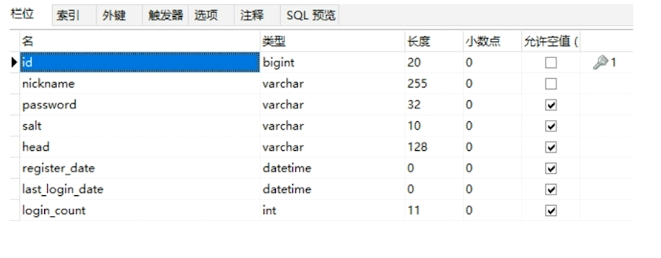

 ```sql
CREATE TABLE miaosha_user (
	id BIGINT ( 20 ) NOT NULL COMMENT "用户ID,手机号码",
	nickname VARCHAR ( 255 ) NOT NULL,
	password VARCHAR ( 32 ) DEFAULT NULL COMMENT 'MD5(MD5(pass明文+固定salt) + salt)',
	salt VARCHAR ( 10 ) DEFAULT NULL,
	head VARCHAR ( 128 ) DEFAULT NULL COMMENT '头像,云存储的ID',
	register_date datetime DEFAULT NULL COMMENT '注册时间',
	last_login_date datetime DEFAULT NULL COMMENT '上次登陆时间',
	login_count INT ( 11 ) DEFAULT '0' COMMENT '登陆次数',
	PRIMARY KEY(id)
) ENGINE = INNODB DEFAULT CHARSET = utf8mb4;

 ```

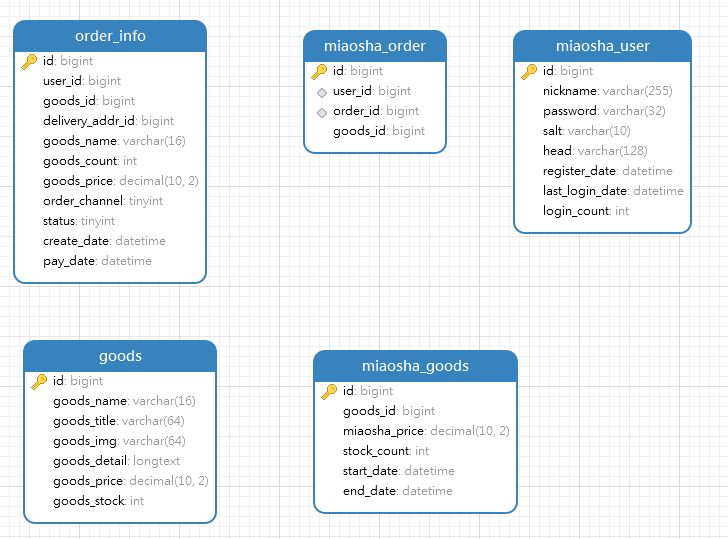

> 1、秒杀用户表
>
> 2、商品表
>
> 3、订单表
>
> 4、秒杀商品表
>
> 5、秒杀订单表


### 2、明文密码两次MD5处理

#### 2.1 原因

> 为什么要加密？
>
> 因为http是明文传输，如果不加密，在传输过程中容易被截取，造成账号安全问题；
>
> 如果数据库存储的是明文密码，对于可以看到明文密码的数据库管理员而言，其可以方便的获取账号及密码，造成账户安全问题。
>
> 所以要进行加密。

#### 2.2 原理

两次MD5
1.用户端:PASS=MD5(明文+固定Salt)
2.服务端:PASS=MD5(用户输入+随机salt)

最终随机的salt存储在数据库中

#### 2.3 加密过程

- 前端

  1、 js，构建md5方法，用明文+固定Salt

  2、 用ajax发送请求，携带数据

- 后端

  1、 导包

  2、 构建MD5Util

  3、 在Service中使用MD5Util，生成随机salt，生成相应的dbPassword


### 3、JSR303参数校验+全局异常处理器

#### 3.1 参数校验

##### 3.1.1 参数校验作用

对浏览器传输过来的参数进行验证，需要每次有参数传入，就当即进行验证。

##### 3.1.2 如何能更方便的进行参数校验

使用JSR303参数检验

##### 3.1.3 步骤

- 导包
- 在VO类上增加注解 @NotNull、@Length、自定义注解等
- 编写自定义注解（实现自定义规则） @IsMobile  验证输入的是否为手机号码


#### 3.2 全局异常处理

##### 3.2.1 为什么需要全局异常处理器？

通过异常处理，来回传一些信息错误提示信息，使得前端得到的提示更友好。

##### 3.2.2 步骤

1.  构建一个GlobalException，用于封装返回数据，并方便Handler类进行捕获
2.  创建exceptionHandler类，来对捕捉到的异常进行分类统一处理

- GlobalException.java

```java
public class GlobalException extends RuntimeException{

    private static final long serialVersionUID = 1L;

    private CodeMsg cm;
    public GlobalException(CodeMsg cm) {
        super(cm.toString());
        this.cm = cm;
    }

    public CodeMsg getCm() {
        return cm;
    }
}
```

- ExceptionHandler.java

```java
@ControllerAdvice
@ResponseBody
public class GlobalExceptionHandler {

    //会自动获取参数
    @ExceptionHandler(Exception.class)
    public Result<String> exceptionHandler(HttpServletResponse response, Exception e) {
        e.printStackTrace();
        if(e instanceof GlobalException) {
            GlobalException ex = (GlobalException) e;
            return Result.error(ex.getCm());
        } else if(e instanceof BindException) {
            BindException ex = (BindException)e;
            List<ObjectError> errors = ex.getAllErrors();

            ObjectError error = errors.get(0);
            String message = error.getDefaultMessage();
            return Result.error(CodeMsg.BIND_ERROR.fillArgs(message));
        } else {
            return Result.error(CodeMsg.SERVER_ERROR);
        }
    }
}
```


### 4. 分布式Session

Http是无状态的协议，无状态体现在服务器不保留与客户交易时的任何状态。上一次的请求对这次的请求没有任何影响，服务端也不会对客户端上一次的请求进行任何记录处理。无状态性导致：用户登录后，切换到其他界面，进行操作，服务器端是无法判断是哪个用户登录的。 每次进行页面跳转的时候，得重新登录。

**解决Http协议的无状态性：**

无状态协议不会记录用户的登录信息，服务器该怎么判断发来的请求是哪个用户？出现两种Http状态保持的技术：Cookie和Session；

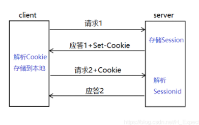

#### 4.1 为什么要用分布式Session

用户登录请求过来，如果服务器创建session，将用户信息记录在session中的话，由于一般应用都会有多服务器，需要进行Session同步，但性能不好，实现起来复杂。


##### 4.1.1 分布式Session的4种解决方案

- Cookie和Session的区别与联系

cookie是本地客户端用来存储少量数据信息的，保存在客户端，用户能够很容易的获取，安全性不高，存储的数据量小
session是服务器用来存储部分数据信息，保存在服务器，用户不容易获取，安全性高，储存的数据量相对大，存储在服务器，会占用一些服务器资源，但是对于它的优点来说，这个缺点可以忽略了

[HTTP协议为什么是无状态的？如何让HTTP"有状态"？](https://blog.csdn.net/H_Expect/article/details/99967490)

- 分布式session的一致性问题

客户端发送一个请求，通过负载均衡，将请求分配到其中一个服务器，不同的服务器有不同的web服务器，当前web服务器如tomcat不能发现之前web服务器保存的session信息，就会再次生成一个JSESSIONID，导致之前的状态丢失。

- 分布式Session一致性问题的解决方案

1、客户端存储：cookie方式

2、session复制：多个web服务器广播异步同步session，在tomcat中进行配置

3、session绑定：采用nginx的ip-hash策略，将客户端与服务器进行绑定，同一个客户端只能访问其绑定的服务器。

4、基于redis存储session方案：企业常用，session数据保存在redis中，redis本身可以做集群，搭建主从。


#### 4.2 如何解决这个问题？

​		可以采用token来标识用户，用户登录成功，生成token，将token与用户的映射存储在Redis缓存中，同时将token保存在浏览器的cookie中，浏览器每次请求，都带着cookie来，从而找到相应的用户。

#### 4.3 步骤

- 创建token，与查出来的用户信息构建映射关系存到Redis中
- 将token存到cookie中，
- 之后获取的时候从cookie或者request中获取
- 并通过token可以获得用户信息

#### 4.4 如何能直接查找到用户

问题：用户要做controller形参，如何能够在调用该handler之前传入？

答：可以通过参数解析器，Spring中通过参数解析器来将参数组织好，从而传入到形参中。


**使用ThreadLocal**：

通常情况下，我们创建的变量是可以被任何⼀个线程访问并修改的。如何让线程拥有自己专属的本地变量？

ThreadLocal类主要解决的就是让每个线程绑定⾃⼰的值，可以将ThreadLocal类形象的⽐喻成存放数据的盒⼦，盒⼦中可以存储每个线程的私有数据。如果你创建了⼀个ThreadLocal变量，那么**访问这个变量的每个线程都会有这个变量的本地副本**，这也是ThreadLocal变量名的由来。他们可以使⽤get和set⽅法来获取默认值或将其值更改为当前线程所存的副本的值，从⽽**避免了线程安全问题**。


**如何在一个http请求中，MiaoshUser对象能够一直传入，而不需要从前端获得？**

将已登录对象存储在ThreadLocal中，每次请求需要用户对象时，从ThreadLocal中获取。避免了每次需要从request中获取，减少了http的传输内容，方便了Controller中MiaoshUser的传入。


- 在已经有缓存的登录对象情况：

1、先获取cookie中的token，或者获取request中的参数token

2、通过token来获取缓存中的对象


## 第三部分：实现秒杀功能

1、数据库设计

2、商品列表页

3、商品详情页

4、订单详情页


### 1、数据库设计

- 商品表
- 订单表
- 秒杀商品表
- 秒杀订单表

```sql
# goods
CREATE TABLE goods(
	id BIGINT(20) NOT NULL AUTO_INCREMENT COMMENT '商品ID',
	goods_name VARCHAR(16) DEFAULT NULL COMMENT '商品名称',
	goods_title VARCHAR(64) DEFAULT NULL COMMENT '商品标题',
	goods_img VARCHAR(64) DEFAULT NULL COMMENT '商品图片',
	goods_detail LONGTEXT COMMENT '商品详情介绍',
	goods_price DECIMAL(10,2) DEFAULT 0.00 COMMENT '商品单价',
	goods_stock INT(11) DEFAULT 0 COMMENT '商品库存，-1表示没有限制',
	PRIMARY KEY(id)
)ENGINE=INNODB AUTO_INCREMENT=3 DEFAULT CHARSET=utf8mb4;

INSERT INTO goods VALUES(1,'iPhoneX','Apple iPhone X(A1865) 64G 银色 移动联通电信4G手机','/img/iphonex.png','Apple iPhone X(A1865) 64G 银色 移动联通电信4G手机',9999,10),(2,'HuaWeiMate 40','HuaWei Mate10 4+64G 白色 移动联通电信4G手机','/img/mate10.png','HuaWei Mate10 4+64G 白色 移动联通电信4G手机',5000,20);


drop TABLE miaosha_goods
# miaosha_goods
CREATE TABLE miaosha_goods(
	id BIGINT(20) NOT NULL AUTO_INCREMENT COMMENT '秒杀的商品ID',
	goods_id BIGINT(20) DEFAULT NULL COMMENT '商品ID',
	miaosha_price decimal(10,2) COMMENT '秒杀价',
	stock_count int(11) DEFAULT NULL COMMENT '库存数量',
	start_date DATETIME DEFAULT NULL COMMENT '秒杀开始时间',
	end_date DATETIME DEFAULT NULL COMMENT '秒杀结束时间',

	PRIMARY KEY(id)
)ENGINE=INNODB AUTO_INCREMENT=3 DEFAULT CHARSET=utf8mb4;


# order_info
create table order_info(
    id BIGINT(20) NOT NULL AUTO_INCREMENT,
    user_id BIGINT(20) DEFAULT NULL COMMENT '用户ID',
    goods_id BIGINT(20) DEFAULT NULL COMMENT '商品ID',
    delivery_addr_id BIGINT(20) DEFAULT NULL COMMENT '收获地址ID',
    goods_name varchar(16) DEFAULT NULL COMMENT '冗余过来的商品名称',
    goods_count int(11) DEFAULT 0 COMMENT '商品数量',
    goods_price decimal(10,2) DEFAULT 0.00 COMMENT '商品单价',
    order_channel tinyint(4)  DEFAULT 0 COMMENT '1PC 2Android 3IOS',
    status tinyint(4) DEFAULT 0 COMMENT '订单状态:  0新建未支付，1已支付，2已发货，3已收货，4已退款，5已完成',
    create_date DATETIME DEFAULT NULL COMMENT '订单创建时间',
    pay_date DATETIME  DEFAULT NULL COMMENT '订单支付时间',
    PRIMARY KEY(id)
)ENGINE=INNODB AUTO_INCREMENT=12 DEFAULT CHARSET=utf8mb4;


# miaosha_order
create table miaosha_order(
    id BIGINT(20) NOT NULL AUTO_INCREMENT,
    user_id BIGINT(20) DEFAULT NULL COMMENT '用户ID',
    order_id BIGINT(20) DEFAULT NULL COMMENT '订单ID',
    goods_id BIGINT(20) DEFAULT NULL COMMENT '商品ID',
    PRIMARY KEY(id)
)ENGINE=INNODB AUTO_INCREMENT=3 DEFAULT CHARSET=utf8mb4;


insert into miaosha_goods values(1,1,0.01,4,'2021-03-27 21:25:00','2021-03-29 21:25:00'),(2,2,0.01,4,'2021-03-27 21:25:00','2021-03-29 21:25:00');

```

**1、创建对应的pojo类**

可以通过idea自带的生成器进行生成，再进行微调

### 2、商品列表

### 3、商品详情

### 4、订单详情


## 第四部分： JMeter压测

- JMeter入门
- 自定义变量模拟多用户

- JMeter命令行使用
- Redis压测工具--beanchmark
- SpringBoot打war包


- **JMeter中名词解释**

> 吞吐量Throughput ：系统单位时间内处理的请求数量
>
> QPS每秒处理的请求数 ：服务器每秒可以执行的查询次数
>
> TPS服务器每秒处理的事务数（可以理解为客户端发送一个请求到收到服务器的响应这一过程）

- **QPS和TPS的区别**

> QPS vs TPS：QPS 基本类似于 TPS，但是不同的是，对于⼀个⻚⾯的⼀次访问，形成⼀个TPS；但⼀次⻚⾯请求，可能产⽣多次对服务器的请求，服务器对这些请求，就可计⼊“QPS”之中。如，访问⼀个⻚⾯会请求服务器2次，⼀次访问，产⽣⼀个“T”，产⽣2个“Q”。

TPS、QPS都是吞吐量的常⽤量化指标。

**QPS（TPS）** = 并发数/平均响应时间(RT，Response time)

**并发数** = QPS * 平均响应时间(RT，Response time)


### JMeter入门

java开发的一款压力测试软件。

测试接口

eg1：测试/goods/to_list

线程组：

1秒钟产生1000个线程，持续10轮。共生成10000次请求。

注意在测试的时候要加token，才能获得user，否则会报错。

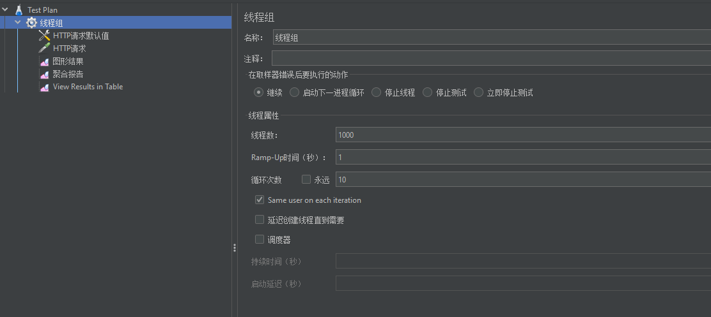

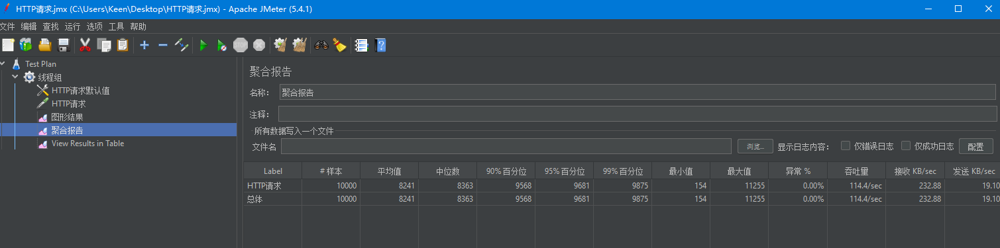

吞吐量为： 114/sec；

eg2: 测试/user/info

线程组同上，

遇到jedis的连接池中资源不够，之后扩大redis的poolMaxTotal，才没有报错

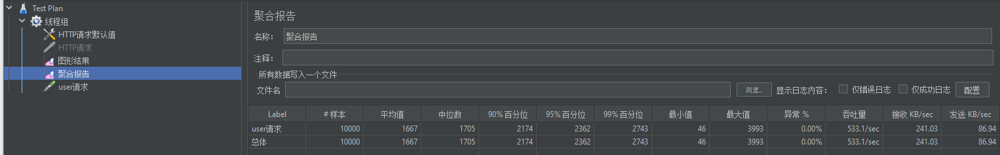

吞吐量为533/sec，比直接访问数据库增快了5倍


### JMeter自定义变量

**使用不同的用户，进行压测**

步骤：

1、 添加配置文件（文件在doc中）-> 添加数据文件CSV数据文件设置 ->

config.txt中 ：

15735184077,99aa27865a7049c8aba75f4faf509e96

在csv文件中：

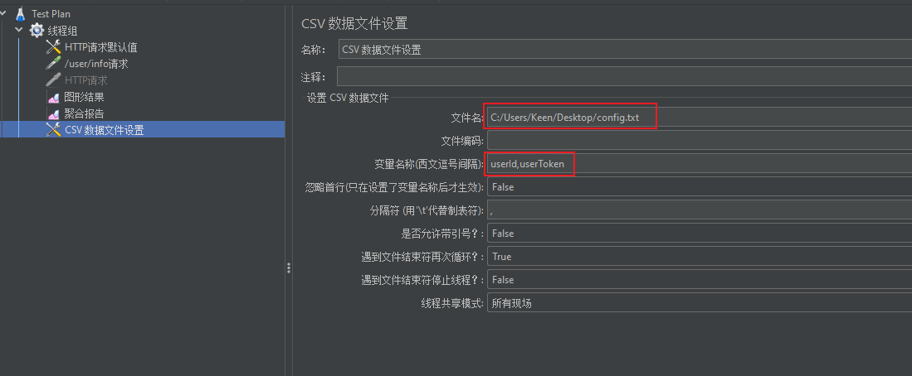

在请求中：

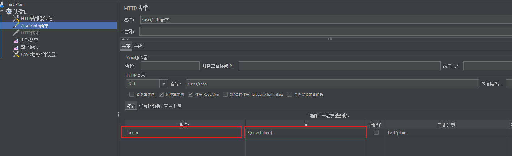

压测结果：

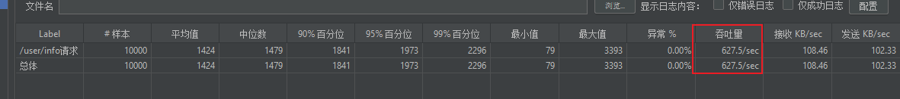

### JMeter命令行

使用步骤：

0、 springBoot项目打jar包

1、 在windows上录好.jmx文件（样例：/doc/HTTP请求.jmx），传到linux上（使用rz命令，选择jmx文件）

2、 在linux上启动服务：  nohup java -jar Seckill.jar  &

​		tail -f nohup.out   查看是否是否正常启动，查看启动日志

3、 命令行： sh jmeter.sh -n -t  XXX.jmx -l result.jtl

4、 用sz命令  result.jtl 导出到windows，并导入到jmeter中查看效果


操作细节：

需要创建多个用户，创建了一个UserUtil类，创建5000个User，并存储到Miaosha用户表中；

在创建之后，模拟登录请求，来获得各自对应的token，并存储在redis中，并将userId及token存储在token.txt中；

该文件在jmeter的csv数据文件设置中进行配置；在linux中，需要修改.jmx 中 csv位置的token位置。


### Redis压测

```bash
# 100个并发连接，100000个请求
redis-benchmark -h 127.0.0.1 -p 6379 -c 100 -n 100000
```

大概能达到  61652.28 requests per second


- 存取大小为100字节的数据包，上边默认测试的是3字节

```bash
redis-benchmark -h 127.0.0.1 -p 6379 -q -d 100    # -q 简写
```

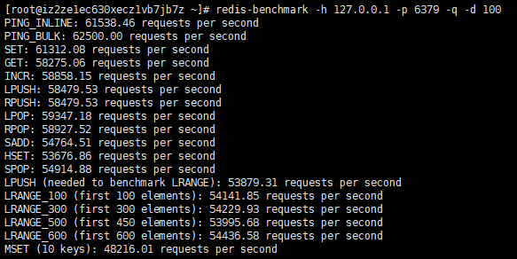


- 只测试部分命令

```bash
redis-benchmark -t set,lpush -n 100000 -q
```

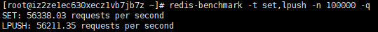


- 只测试这条命令

```bash
redis-benchmark -n 100000 -q script load "redis.call('set','foo','bar')"
```

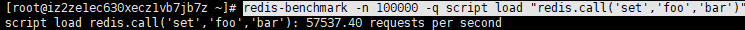

### SpringBoot 打war包

1、 在pom文件中增加

```xml
<groupId>org.lzj</groupId>
<artifactId>Seckill</artifactId>
<version>1.0-SNAPSHOT</version>
<packaging>war</packaging>     <!-- 增加打包方式为 war包 -->

<build>
    <finalName>${project.artifactId}</finalName>  
    <plugin>
        <groupId>org.apache.maven.plugins</groupId>
        <artifactId>maven-war-plugin</artifactId>
        <version>3.3.1</version>
        <configuration>
            <failOnMissingWebXml>false</failOnMissingWebXml>
        </configuration>
    </plugin>
</build>
```

2、 修改SpringBoot的入口如下，继承SpringBootServletInitializer+重写configure方法

```java
@SpringBootApplication
public class MainApplication extends SpringBootServletInitializer
{
    public static void main( String[] args ) {
        SpringApplication.run(MainApplication.class, args);
    }

    @Override
    protected SpringApplicationBuilder configure(SpringApplicationBuilder builder) {
        return builder.sources(MainApplication.class);
    }
}
```


3、 在terminal中输入打包命令

```bash
mvn clean package
```

生成的Seckill.war保存在targets目录中

4、 部署

将Seckill.war直接复制到tomcat目录下的webapps中，或者直接到webapps/ROOT目录下，在开启了tomcat服务器后，可通过8080端口访问web服务。


## 第五部分：页面优化及高并发秒杀优化

使用Redis缓存和静态化分离方式

1、页面缓存+URL缓存+对象缓存

2、页面静态化（纯html+ajax，浏览器缓存静态数据在客户端，不需要从服务器来获得）+前后端分离

3、静态资源优化

4、CDN优化


### 1、页面缓存

将页面html的字符串缓存到redis中，设定一个较短的有效期

goods_list页面 (每个)

并不直接从系统中进行渲染，而是先从缓存中取，找到了直接返回客户端，没找到，则从服务器中取，获得之后，渲染到页面，并保存在客户端中。

1、取缓存

2、手动渲染

3、写到输出中


页面缓存有效期应当比较短，比如说60s，

页面只有部分数据要变。


### 2、URL缓存

不同的id对应不同的秒杀页面，此时不同的url对应的页面均要进行缓存。


变化不大的页面使用以上两种缓存。且缓存页面会自动失效，不需要进行干预。


### 3、对象缓存

力度最小

如在用户登录模块，通过一个token获得一个User ，使其永久有效。

通过token存User到redis中。

但要注意当update或者delete时，调用时，在数据更新后，必须将缓存进行一致性保障，token相应的缓存进行更新，getById相应的缓存需要进行删除，不处理导致缓存中数据与数据库中的数据发生不一致。

 

### 4、页面静态化

可以使用AngularJS、VUE等来进行。

将页面直接缓存到浏览器上，不用再去服务器上去获取。

利用浏览器缓存

使用Jquery来进行模拟。

异步请求，不需要后端进行页面的渲染。

完成步骤：

在static中创建一个静态htm页面，当跳转到该htm页面时，页面直接发送ajax请求，来获取页面数据，并进行填充。从而达到页面缓存的效果。

### 5、秒杀静态化

因为页面进行了静态化处理，故不使用request请求来进行获取数据（无法通过model.setAttribute的方式来回传模型数据），所以此处采用ajax，回传Result，将秒杀后的订单信息传输到ajax中的回调函数中。

304状态码：

向服务端发送了请求，如果没有发生改变，服务端让客户端去缓存中找；问题是还是发送了请求到服务端。如何能使浏览器直接从客户端取数据，不需要询问服务端呢？

**spring.resources 静态资源处理 配置**

```properties
#static
spring.resources.add-mappings=true
spring.resources.cache-period= 3600
spring.resources.chain.cache=true 
spring.resources.chain.enabled=true
spring.resources.chain.gzipped=true
spring.resources.chain.html-application-cache=true
spring.resources.static-locations=classpath:/static/
```

这样，浏览器请求不会发送到服务器，直接得到缓存的结果。


### 6、订单详情静态化，解决超卖问题

**超卖问题为什么会发生？**


**解决超卖：**

1、 Sql加库存数量判断：防止库存变为复数

2、数据库加唯一索引：防止用户重复购买


无法对QPS有什么贡献


问题1：当多个用户同时发出请求，减少库存时，同时发生，没有再sql语句上做限制

解决：在sql语句上做库存数量的限制

```sql
update miaosha_goods set stock_count = stock_count - 1 where goods_id = #{goodsId} and stock_count > 0
```


问题2：但要是一个用户同时发出两个秒杀请求，发现库存均满足，此时会造成一个人秒杀到两件商品。

解决：要限制一个用户只能秒杀一个商品，可以考虑在数据库设计时将秒杀的订单信息表单独创建一个表，并在字段userId及goodId上做unique索引； 前端在提交表单前填验证码，防止同时发送两个相同的请求。

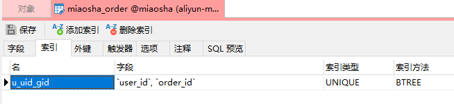

 

### 7、静态资源优化

1、JS/CSS压缩，减少流量

2、多个JS/CSS组合，一次请求下来，减少连接数    淘宝的Tengine

3、使用webpack进行打包，去掉空格多余字符

4、CDN就近访问，内容分发网络，将数据在网络中进行缓存。


几层缓存：

- 浏览器缓存
- CDN缓存
- nginx缓存
- 应用程序中的页面缓存
- 对象缓存

尽量在满足数据一致性的情况下进行缓存。


## 第六部分：秒杀接口优化

1、Redis预减库存减少数据库的访问

2、内存标记减少Redis的访问 （减小网络通信耗时）

3、请求先入队缓冲（使用RabbitMQ），异步下单，增强用户体验

4、RabbitMQ与SpringBoot集成

5、Nginx水平扩展

6、压测

7、数据库的分库分表  秒杀由于商品少，不需要进行分库分表，如果是双十一这种量级的，则需要进行分库分表处理  **mycat分库分表的中间件**

> 根本思路：减少数据库的访问，mysql只能抗住几千的并发

### 1、Redis预减库存减少数据库的访问

思路与步骤：

1、系统初始化，将商品库存加载到Redis中

2、收到请求后，Redis预减库存，库存不足，直接返回，否则进入3

3、请求入队进入消息队列，并立即返回排队中

4、请求出队RabbitMQ，减少库存，生成订单

5、客户端轮询，是否秒杀成功


#### 1.1、 安装RabbitMQ

安装erlang

[Erlang Programming Language download](https://www.erlang.org/downloads)

下载tar.gz，并上传到linux上

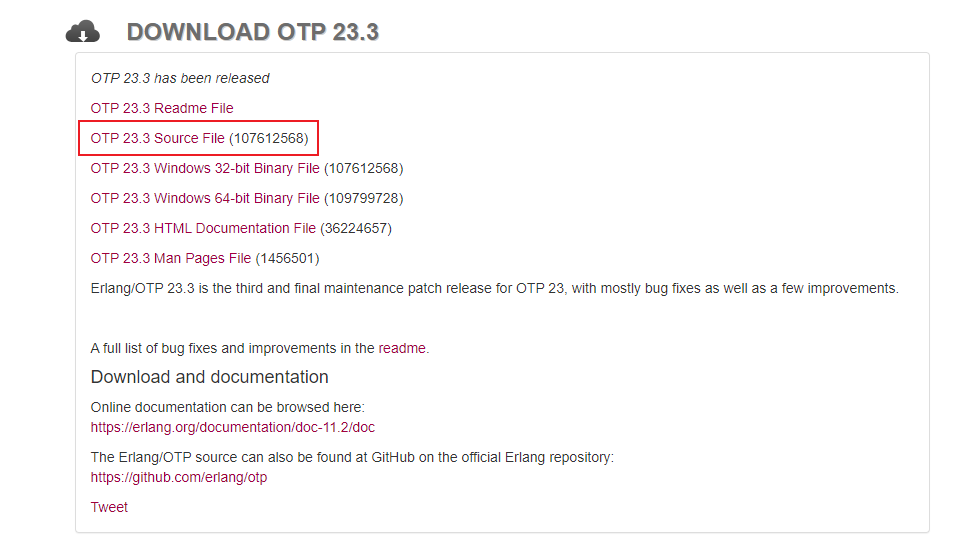

```bash
# 安装依赖
yum install ncurses-devel
# 解压erlang
tar -xf opt_src_23.3.tar.gz
./configure --prefix=/usr/local/erlang23 --enable-hipe--enable-threads --enable-smp-support --enable-kernel-poll --without-javac
make -j 4  # 用四个CPU进行编译
make install
cd /usr/local/erlang23
cd bin
./erl

```

安装RabbitMQ

下载[Downloading and Installing RabbitMQ — RabbitMQ](https://www.rabbitmq.com/download.html)

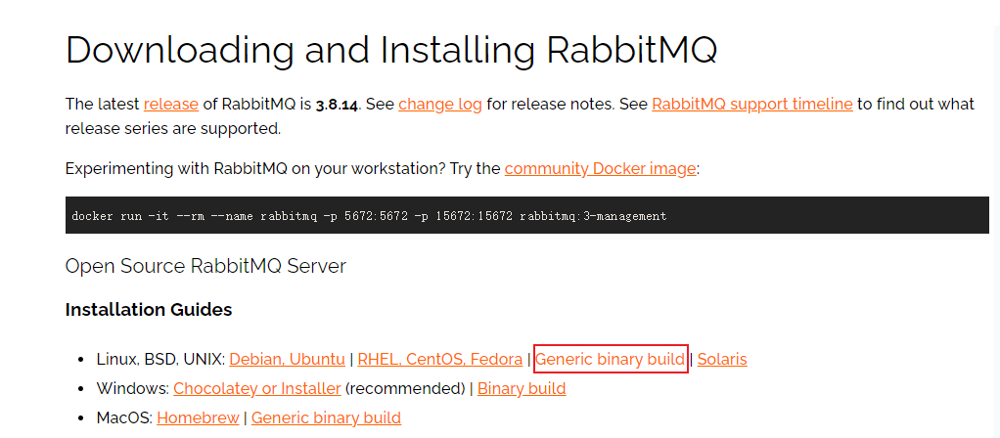

传到linux

```bash
# 解压
xz -d rabbitmq-server-generic-unix-3.8.14.tar.xz
tar xf rabbitmq-server-generic-unix-3.8.14.tar
# 安装几个依赖
yum install python -y
yum install xmlto 
yum install python-simplejson

```

启动RabbitMQ

```bash
mv rabbitmq_server-3.8.14/ /usr/local/rabbitmq
cd /usr/local/rabbitmq
cd sbin

# 更新环境变量
vi /etc/profile
增加下边两行
# set erlang environment
export PATH=$PATH:/usr/local/erlang23/bin

# set rabbitmq environment
export PATH=$PATH:/usr/local/rabbitmq/sbin
wq

# 使修改生效
source /etc/profile

# 后台启动服务器
rabbitmq-server -detached

#查看启动日志
tail -f /usr/local/rabbitmq/var/log/rabbitmq/rabbit@VM-0-9-centos.log

# 查看监听的端口
netstat -nap|grep 5672
ps -ef|grep rabbit

# 停止服务器
rabbitmqctl shutdown
rabbitmqctl stop


# 开启对外部的访问  这样就能在外部通过 ip:15672  来查看网页监控rabbitmq的状态
rabbitmq-plugins enable rabbitmq_management

默认用户guest，密码guest
# 需要开始远程用户访问权限

```


SpringBoot集成RabbitMQ：

1、 导包

```xml
<dependency>  
    <groupId>org.springframework.boot</groupId>  
    <artifactId>spring-boot-starter-amqp</artifactId>  
</dependency>
```

2、添加配置

```properties
#rabbitmq
spring.rabbitmq.host=10.110.3.62
spring.rabbitmq.port=5672
spring.rabbitmq.username=guest
spring.rabbitmq.password=guest
spring.rabbitmq.virtual-host=/
#\u6D88\u8D39\u8005\u6570\u91CF
spring.rabbitmq.listener.simple.concurrency= 10
spring.rabbitmq.listener.simple.max-concurrency= 10
# 每次从队列中取一个
spring.rabbitmq.listener.simple.prefetch= 1
#\u6D88\u8D39\u8005\u81EA\u52A8\u542F\u52A8
spring.rabbitmq.listener.simple.auto-startup=true
# 消费失败，重新进队
spring.rabbitmq.listener.simple.default-requeue-rejected= true
# 队列满了后
spring.rabbitmq.template.retry.enabled=true 
spring.rabbitmq.template.retry.initial-interval=1000 
spring.rabbitmq.template.retry.max-attempts=3
spring.rabbitmq.template.retry.max-interval=10000
spring.rabbitmq.template.retry.multiplier=1.0
```

3、构建

- 构建MQConfig配置
- 构建发送者
- 构建接收者

4、四种交换机Exchange模式

> 交换机起到一个中间转发的作用，指定哪种消息到哪个队列，满足条件的消息存到指定的队列。

发送者先把消息发送到交换机，再到队列

Direct模式：不用到交换机

Topic模式：发送者发送消息到交换机，交换机根据发送消息的key，来判断哪个接收者满足，从而分发到不同的队列中去。其中key中的*代表单个字符，#代表多个字符。

Fanout模式：广播模式   不需要key

Head模式： exchange需要绑定queue以及一个map；只有发送者发送的消息满足map，才会将message加入到相应的queue中


### 2、秒杀接口优化

将同步下单改造成异步下单方式。

1、Redis预减库存减少数据库的访问

2、内存标记减少Redis的访问 （减小网络通信耗时）

3、请求先入队缓冲（使用RabbitMQ），异步下单，增强用户体验

4、Nginx水平扩展


## 第七部分：图形验证码与恶意防刷

秒杀接口地址隐藏

数学公式验证码

接口限流防刷

### 1、秒杀接口地址隐藏

- **为什么要对秒杀接口地址进行隐藏？**

Http协议是明文传输，透明的，前端无法控制恶意用户进行攻击）安全校验还是要放在服务端，禁止掉这些恶意服务。如果不对秒杀接口地址进行隐藏，可能会存在使用工具连续访问不断的进行秒杀，从而导致秒杀负载过高，并发量大。

思路：秒杀开始前，先去请求接口获取真实的秒杀地址，根据回传的秒杀path，发送秒杀请求，

1、获取path，使用UUID生成，并传回，获得真正的请求地址

2、发起秒杀请求，带上PathVariable参数，value = "/{path}/do_miaosha"  @PathVariable("path") String path

3、验证path，通过后再进行秒杀


每次点击秒杀的url地址不同，只有真正点击秒杀按钮，才会根据商品和用户id生成对应的秒杀地址接口。

- 但是秒杀未开始前，获取秒杀地址，也可以进行秒杀到，所以可以考虑在Redis中存储一个秒杀是否开始的标志，在秒杀未开始前，是不能进行秒杀操作，从而不会造成接口频繁被刷。


### 2、 数学公式验证码

思路： 点击秒杀前，先输入验证码，分散用户的请求。

流程分析：

- 构造验证码
- 传输验证码
- 验证验证码

在构造验证码图片时使用Redis存储验证结果，验证码在倒计时结束后显示验证码，验证码图片通过流传输过来。

点击完立即秒杀按钮后，先获取秒杀路径，在获取秒杀路径过程中，先验证验证码采用ScriptEngine对传回来的字符串进行解析并计算，验证通过后，再生成秒杀路径，并将path传回页面。


### 3、接口防刷限流

> - 内存标记库存状态，减少redis访问
> - 限制某个用户对某个接口访问次数
> - 接口限流通用化

- 内存标记库存状态，减少redis访问

思路：hashmap，标记库存状态，当库存不够后，不需要去redis中去查找

实现：当预减后得库存小于0时，标记为true，直接返回秒杀结束的结果；当库存大于0，默认状态为false；


- 限制某个用户对某个接口1s钟内访问次数

思路：5s限制访问5次，超过5次请求

实现：redis缓存中存储访问的count，使用redis缓存中记录 access_uri_userId : count，设置缓存有效期为5s，5s内访问超5次，返回错误信息；redis缓存失效后，重新开始计数。


- 接口限流通用化

思路：通过拦截器，处理请求到达Controller之前，进行验证是否满足接口限流的限制。

实现：通过自定义注解进行实现，创建@AccessLimit(seconds = 5, maxCount = 5, needLogin = true)，在登录的状态下，多少秒内限制多少次访问。

构建自定义注解步骤：

1、创建注解，在注解上添加使用范围，在注解声明中添加属性（以方法的形式）；

2、创建拦截器，继承HandlerInterceptorAdapter，参见org.lzj.miaosha.access.AccessInterceptor

.java


- 使用ThreadLocal


## 参考链接

1、[常见的秒杀设计思路 by CSDN](https://blog.csdn.net/ju_362204801/article/details/87931992)

2、[高性能网站设计之缓存更新的套路 by简书](https://blog.csdn.net/tTU1EvLDeLFq5btqiK/article/details/78693323)

3、[秒杀架构模型设计 by 知乎](https://zhuanlan.zhihu.com/p/76612241)

4、[记一次性能优化，单台 4 核 8G 机器支撑 5 万 QPS (qq.com)](https://mp.weixin.qq.com/s/a26m1uF6TLvlLxcwh8QY4g)


