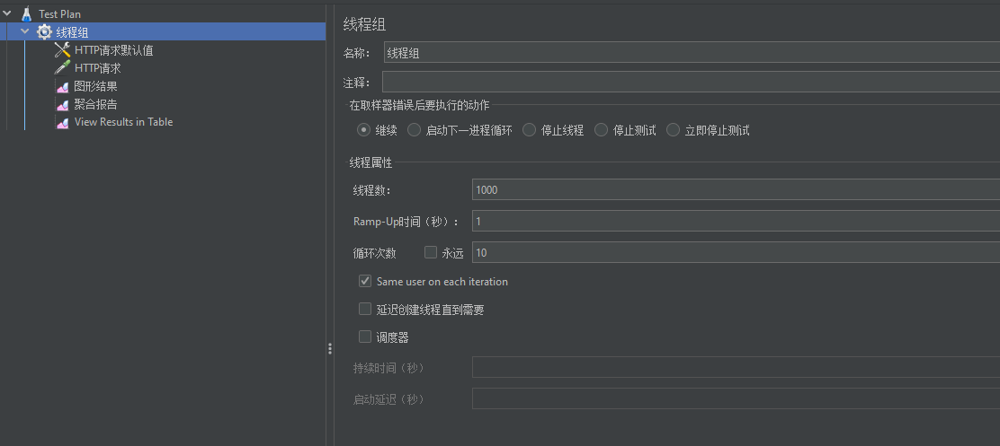
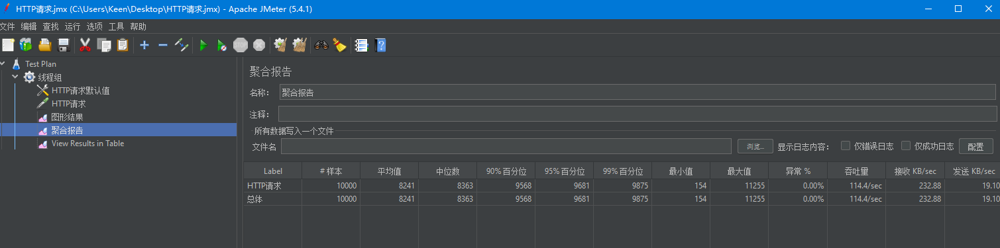
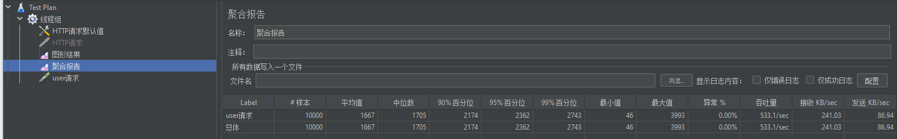
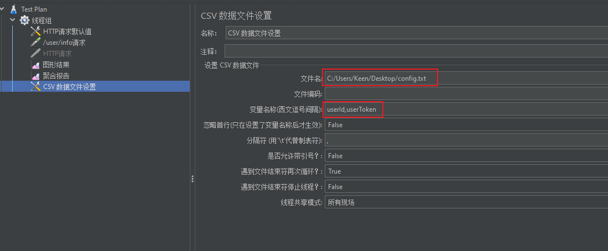
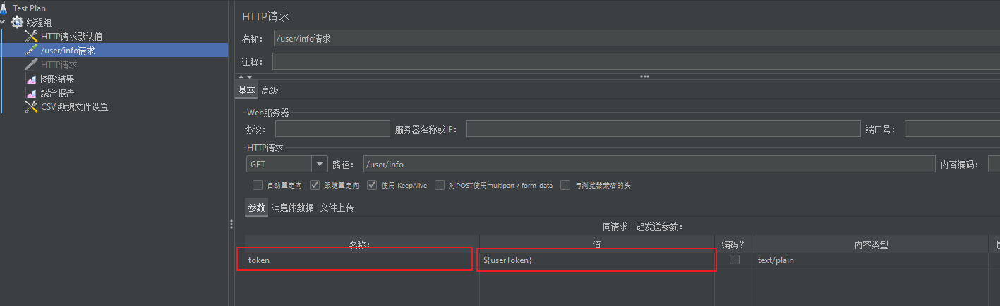
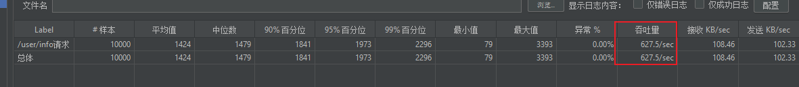
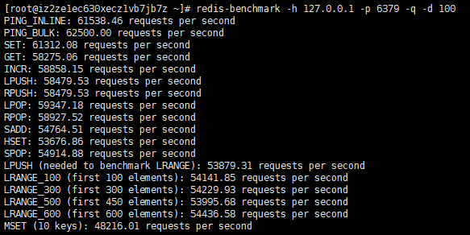
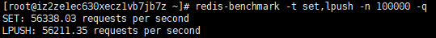
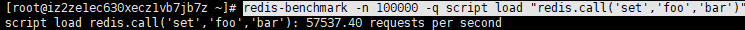

## 第二部分：登录功能

1. 数据库设计
2. 明文密码两次MD5处理
3. JSR303参数校验+全局异常处理器
4. 分布式Session

### 1、 数据库设计


 ```sql
CREATE TABLE miaosha_user (
	id BIGINT ( 20 ) NOT NULL COMMENT "用户ID,手机号码",
	nickname VARCHAR ( 255 ) NOT NULL,
	password VARCHAR ( 32 ) DEFAULT NULL COMMENT 'MD5(MD5(pass明文+固定salt) + salt)',
	salt VARCHAR ( 10 ) DEFAULT NULL,
	head VARCHAR ( 128 ) DEFAULT NULL COMMENT '头像,云存储的ID',
	register_date datetime DEFAULT NULL COMMENT '注册时间',
	last_login_date datetime DEFAULT NULL COMMENT '上次登陆时间',
	login_count INT ( 11 ) DEFAULT '0' COMMENT '登陆次数',
	PRIMARY KEY(id)
) ENGINE = INNODB DEFAULT CHARSET = utf8mb4;

 ```

### 2、明文密码两次MD5处理

#### 2.1 原因

> 为什么要加密？
>
> 因为http是明文传输，如果不加密，在传输过程中容易被截取，造成账号安全问题；
>
> 如果数据库存储的是明文密码，对于可以看到明文密码的数据库管理员而言，其可以方便的获取账号及密码，造成账户安全问题。
>
> 所以要进行加密。

#### 2.2 原理

两次MD5
1.用户端:PASS=MD5(明文+固定Salt)
2.服务端:PASS=MD5(用户输入+随机salt)

最终随机的salt存储在数据库中

#### 2.3 加密过程

- 前端

  1、 js，构建md5方法，用明文+固定Salt

  2、 用ajax发送请求，携带数据

- 后端

  1、 导包

  2、 构建MD5Util

  3、 在Service中使用MD5Util，生成随机salt，生成相应的dbPassword


### 3、JSR303参数校验+全局异常处理器

#### 3.1 参数校验

##### 3.1.1 参数校验作用

对浏览器传输过来的参数进行验证，需要每次有参数传入，就当即进行验证。

##### 3.1.2 如何能更方便的进行参数校验

使用JSR303参数检验

##### 3.1.3 步骤

- 导包
- 在VO类上增加注解 @NotNull、@Length、自定义注解等
- 编写自定义注解（实现自定义规则）


#### 3.2 全局异常处理

##### 3.2.1 为什么需要全局异常处理器？

通过异常处理，来回传一些信息错误提示信息，使得前端得到的提示更友好。

##### 3.2.2 步骤

1.  构建一个GlobalException，用于封装返回数据，并方便Handler类进行捕获
2.  创建exceptionHandler类，来对捕捉到的异常进行分类统一处理


### 4. 分布式Session

#### 4.1 为什么要用分布式Session

用户登录请求过来，如果服务器创建session，将用户信息记录在session中的话，由于一般应用都会有多态服务器，需要进行Session同步，但性能不好，实现起来复杂。


#### 4.2 如何解决这个问题？

可以采用token来标识用户，用户登录成功，生成token，将token与用户的映射存储在Redis缓存中，并讲讲token保存在浏览器的cookie中，浏览器每次请求，都带着cookie来，从而找到相应的用户。

#### 4.3 步骤

- 创建token，与查出来的用户信息构建映射关系存到Redis中
- 将token存到cookie中，
- 之后获取的时候从cookie或者request中获取
- 并通过token可以获得用户信息

#### 4.4 如何能直接查找到用户

问题：用户要做controller形参，如何能够在调用该handler之前传入？

答：可以通过参数解析器，Spring中通过参数解析器来将参数组织好，从而传入到形参中


## 第三部分：实现秒杀功能

1、数据库设计

2、商品列表页

3、商品详情页

4、订单详情页


### 1、 数据库设计

- 商品表
- 订单表
- 秒杀商品表
- 秒杀订单表

```sql
# goods
CREATE TABLE goods(
	id BIGINT(20) NOT NULL AUTO_INCREMENT COMMENT '商品ID',
	goods_name VARCHAR(16) DEFAULT NULL COMMENT '商品名称',
	goods_title VARCHAR(64) DEFAULT NULL COMMENT '商品标题',
	goods_img VARCHAR(64) DEFAULT NULL COMMENT '商品图片',
	goods_detail LONGTEXT COMMENT '商品详情介绍',
	goods_price DECIMAL(10,2) DEFAULT 0.00 COMMENT '商品单价',
	goods_stock INT(11) DEFAULT 0 COMMENT '商品库存，-1表示没有限制',
	PRIMARY KEY(id)
)ENGINE=INNODB AUTO_INCREMENT=3 DEFAULT CHARSET=utf8mb4;

INSERT INTO goods VALUES(1,'iPhoneX','Apple iPhone X(A1865) 64G 银色 移动联通电信4G手机','/img/iphonex.png','Apple iPhone X(A1865) 64G 银色 移动联通电信4G手机',9999,10),(2,'HuaWeiMate 40','HuaWei Mate10 4+64G 白色 移动联通电信4G手机','/img/mate10.png','HuaWei Mate10 4+64G 白色 移动联通电信4G手机',5000,20);


drop TABLE miaosha_goods
# miaosha_goods
CREATE TABLE miaosha_goods(
	id BIGINT(20) NOT NULL AUTO_INCREMENT COMMENT '秒杀的商品ID',
	goods_id BIGINT(20) DEFAULT NULL COMMENT '商品ID',
	miaosha_price decimal(10,2) COMMENT '秒杀价',
	stock_count int(11) DEFAULT NULL COMMENT '库存数量',
	start_date DATETIME DEFAULT NULL COMMENT '秒杀开始时间',
	end_date DATETIME DEFAULT NULL COMMENT '秒杀结束时间',

	PRIMARY KEY(id)
)ENGINE=INNODB AUTO_INCREMENT=3 DEFAULT CHARSET=utf8mb4;


# order_info
create table order_info(
    id BIGINT(20) NOT NULL AUTO_INCREMENT,
    user_id BIGINT(20) DEFAULT NULL COMMENT '用户ID',
    goods_id BIGINT(20) DEFAULT NULL COMMENT '商品ID',
    delivery_addr_id BIGINT(20) DEFAULT NULL COMMENT '收获地址ID',
    goods_name varchar(16) DEFAULT NULL COMMENT '冗余过来的商品名称',
    goods_count int(11) DEFAULT 0 COMMENT '商品数量',
    goods_price decimal(10,2) DEFAULT 0.00 COMMENT '商品单价',
    order_channel tinyint(4)  DEFAULT 0 COMMENT '1PC 2Android 3IOS',
    status tinyint(4) DEFAULT 0 COMMENT '订单状态:  0新建未支付，1已支付，2已发货，3已收货，4已退款，5已完成',
    create_date DATETIME DEFAULT NULL COMMENT '订单创建时间',
    pay_date DATETIME  DEFAULT NULL COMMENT '订单支付时间',
    PRIMARY KEY(id)
)ENGINE=INNODB AUTO_INCREMENT=12 DEFAULT CHARSET=utf8mb4;


# miaosha_order
create table miaosha_order(
    id BIGINT(20) NOT NULL AUTO_INCREMENT,
    user_id BIGINT(20) DEFAULT NULL COMMENT '用户ID',
    order_id BIGINT(20) DEFAULT NULL COMMENT '订单ID',
    goods_id BIGINT(20) DEFAULT NULL COMMENT '商品ID',
    PRIMARY KEY(id)
)ENGINE=INNODB AUTO_INCREMENT=3 DEFAULT CHARSET=utf8mb4;


insert into miaosha_goods values(1,1,0.01,4,'2021-03-27 21:25:00','2021-03-29 21:25:00'),(2,2,0.01,4,'2021-03-27 21:25:00','2021-03-29 21:25:00');

```

**1、创建对应的pojo类**

可以通过idea自带的生成器进行生成，再进行微调

### 2、商品列表

### 3、商品详情

### 4、订单详情


## 第四部分： JMeter压测

- JMeter入门
- 自定义变量模拟多用户

- JMeter命令行使用
- Redis压测工具--beanchmark
- SpringBoot打war包


### JMeter入门

java开发的一款压力测试软件。

测试接口

eg1：测试/goods/to_list

线程组：

1秒钟产生1000个线程，持续10轮。共生成10000次请求。

注意在测试的时候要加token，才能获得user，否则会报错。





吞吐量为： 114/sec；

eg2: 测试/user/info

线程组同上，

遇到jedis的连接池中资源不够，之后扩大redis的poolMaxTotal，才没有报错



吞吐量为533/sec，比直接访问数据库增快了5倍**


### JMeter自定义变量

**使用不同的用户，进行压测**

步骤：

1、 添加配置文件-> 添加数据文件CSV数据文件设置 ->

config.txt中 ：

15735184077,99aa27865a7049c8aba75f4faf509e96

在csv文件中：



在请求中：



压测结果：



### JMeter命令行

使用步骤：

0、 springBoot项目打jar包

1、 在windows上录好.jmx文件，传到linux上（使用rz命令，选择jmx文件）

2、 在linux上启动服务：  nohup java -jar Seckill.jar

3、 命令行： sh jmeter.sh -n -t  XXX.jmx -l result.jtl

4、 用sz命令  result.jtl 导出到windows，并导入到jmeter中查看效果


操作细节：

需要创建多个用户，创建了一个UserUtil类，创建5000个User，并存储到Miaosha用户表中；

在创建之后，模拟登录请求，来获得各自对应的token，并存储在redis中，并将userId及token存储在token.txt中；

该文件在jmeter的csv数据文件设置中进行配置；在linux中，需要修改.jmx 中 csv位置的token位置。


### Redis压测

```bash
# 100个并发连接，100000个请求
redis-benchmark -h 127.0.0.1 -p 6379 -c 100 -n 100000
```

大概能达到  61652.28 requests per second


- 存取大小为100字节的数据包，上边默认测试的是3字节

```bash
redis-benchmark -h 127.0.0.1 -p 6379 -q -d 100    # -q 简写
```




- 只测试部分命令

```bash
redis-benchmark -t set,lpush -n 100000 -q
```




- 只测试这条命令

```bash
redis-benchmark -n 100000 -q script load "redis.call('set','foo','bar')"
```



### SpringBoot 打war包

1、 在pom文件中增加

```xml
<groupId>org.lzj</groupId>
<artifactId>Seckill</artifactId>
<version>1.0-SNAPSHOT</version>
<packaging>war</packaging>     <!-- 增加打包方式为 war包 -->

<build>
    <finalName>${project.artifactId}</finalName>  
    <plugin>
        <groupId>org.apache.maven.plugins</groupId>
        <artifactId>maven-war-plugin</artifactId>
        <version>3.3.1</version>
        <configuration>
            <failOnMissingWebXml>false</failOnMissingWebXml>
        </configuration>
    </plugin>
</build>
```

2、 修改SpringBoot的入口如下，继承SpringBootServletInitializer+重写configure方法

```java
@SpringBootApplication
public class MainApplication extends SpringBootServletInitializer
{
    public static void main( String[] args ) {
        SpringApplication.run(MainApplication.class, args);
    }

    @Override
    protected SpringApplicationBuilder configure(SpringApplicationBuilder builder) {
        return builder.sources(MainApplication.class);
    }
}
```


3、 在terminal中输入打包命令

```bash
mvn clean package
```

生成的Seckill.war保存在targets目录中

4、 部署

将Seckill.war直接复制到tomcat目录下的webapps中，或者直接到webapps/ROOT目录下，在开启了tomcat服务器后，可通过8080端口访问web服务。


## 第五部分：页面优化及高并发秒杀优化

使用Redis缓存和静态化分离方式

1、页面缓存+URL缓存+对象缓存

2、页面静态化（纯html+ajax，浏览器缓存静态数据在客户端，不需要从服务器来获得）+前后端分离

3、静态资源优化

4、CDN优化


### 1、页面缓存

将页面html的字符串缓存到redis中，设定一个较短的有效期

并不直接从系统中进行渲染，而是先从缓存中取，找到了直接返回客户端，没找到，则从服务器中取，获得之后，渲染到页面，并保存在客户端中。

1、取缓存

2、手动渲染

3、写到输出中


页面缓存有效期应当比较短，比如说60s，

页面只有部分数据要变。


### 2、URL缓存

不同的id对应不同的页面，此时不同的url对应的页面均要进行缓存。


变化不大的页面使用以上两种缓存。自动失效，不需要进行干预。


### 3、对象缓存

力度最小

如在用户登录模块，通过一个token获得一个User 


使其永久有效。

通过token存User到redis中。


当update或者delete时，调用时，在数据更新后，必须将缓存进行一致性保障，token相应的缓存进行更新，getById相应的缓存需要进行删除，不处理导致缓存中数据与数据库中的数据发生不一致。

 

### 4、页面静态化

可以使用VUE或者

将页面直接缓存到浏览器上，不用再去服务器上去获取。

利用浏览器缓存


