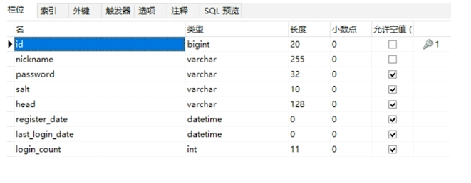

## 第二部分
1. 数据库设计
2. 明文密码两次MD5处理
3. JSR303参数校验+全局异常处理器
4. 分布式Session

### 1、 数据库设计



 ```sql
CREATE TABLE miaosha_user (
	id BIGINT ( 20 ) NOT NULL COMMENT "用户ID,手机号码",
	nickname VARCHAR ( 255 ) NOT NULL,
	password VARCHAR ( 32 ) DEFAULT NULL COMMENT 'MD5(MD5(pass明文+固定salt) + salt)',
	salt VARCHAR ( 10 ) DEFAULT NULL,
	head VARCHAR ( 128 ) DEFAULT NULL COMMENT '头像,云存储的ID',
	register_date datetime DEFAULT NULL COMMENT '注册时间',
	last_login_date datetime DEFAULT NULL COMMENT '上次登陆时间',
	login_count INT ( 11 ) DEFAULT '0' COMMENT '登陆次数',
	PRIMARY KEY(id)
) ENGINE = INNODB DEFAULT CHARSET = utf8mb4;

 ```

### 2、明文密码两次MD5处理

#### 2.1 原因

> 为什么要加密？
>
> 因为http是明文传输，如果不加密，在传输过程中容易被截取，造成账号安全问题；
>
> 如果数据库存储的是明文密码，对于可以看到明文密码的数据库管理员而言，其可以方便的获取账号及密码，造成账户安全问题。
>
> 所以要进行加密。

#### 2.2 原理

两次MD5
1.用户端:PASS=MD5(明文+固定Salt)
2.服务端:PASS=MD5(用户输入+随机salt)

最终随机的salt存储在数据库中

#### 2.3 加密过程

- 前端

  1、 js，构建md5方法，用明文+固定Salt

  2、 用ajax发送请求，携带数据

- 后端

  1、 导包

  2、 构建MD5Util

  3、 在Service中使用MD5Util，生成随机salt，生成相应的dbPassword


### 3、JSR303参数校验+全局异常处理器

#### 3.1 参数校验

##### 3.1.1 参数校验作用

对浏览器传输过来的参数进行验证，需要每次有参数传入，就当即进行验证。

##### 3.1.2 如何能更方便的进行参数校验

使用JSR303参数检验

##### 3.1.3 步骤

- 导包
- 在VO类上增加注解 @NotNull、@Length、自定义注解等
- 编写自定义注解（实现自定义规则）


#### 3.2 全局异常处理

##### 3.2.1 为什么需要全局异常处理器？

通过异常处理，来回传一些信息错误提示信息，使得前端得到的提示更友好。

##### 3.2.2 步骤

1.  构建一个GlobalException，用于封装返回数据，并方便Handler类进行捕获
2.  创建exceptionHandler类，来对捕捉到的异常进行分类统一处理


### 4. 分布式Session

#### 4.1 为什么要用分布式Session

用户登录请求过来，如果服务器创建session，将用户信息记录在session中的话，由于一般应用都会有多态服务器，需要进行Session同步，但性能不好，实现起来复杂。


#### 4.2 如何解决这个问题？

可以采用token来标识用户，用户登录成功，生成token，将token与用户的映射存储在Redis缓存中，并讲讲token保存在浏览器的cookie中，浏览器每次请求，都带着cookie来，从而找到相应的用户。

#### 4.3 步骤


